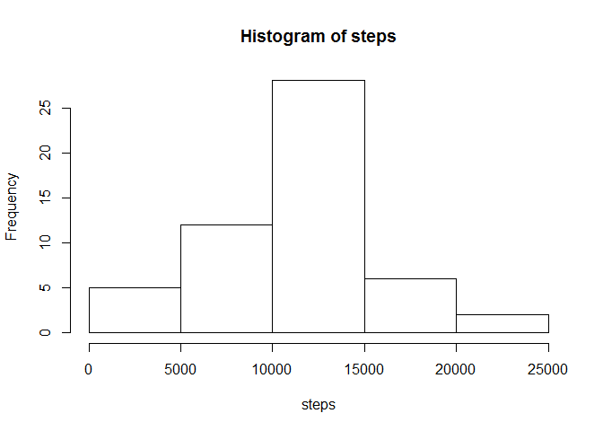

## Loading and preprocessing the data


```r
unzip("D:/Users/philcarmine/Documents/RepData_PeerAssessment1-master/RepData_PeerAssessment1-master/activity.zip")
dataset <- read.csv("D:/Users/philcarmine/Documents/RepData_PeerAssessment1-master/RepData_PeerAssessment1-master/activity.csv")
library("dplyr")
```

```
## 
## Attaching package: 'dplyr'
```

```
## The following objects are masked from 'package:stats':
## 
##     filter, lag
```

```
## The following objects are masked from 'package:base':
## 
##     intersect, setdiff, setequal, union
```

```r
totalperday <- aggregate(dataset$steps, by=list(dataset$date), FUN=sum)
totalperday <- data.frame(Date=totalperday$Group.1, Steps=totalperday$x)
```

## Histogram of total number of steps taken each day


```r
steps <- totalperday$Steps
steps <- na.omit(steps)
hist(steps)
```

<!-- -->

## What is mean and median total number of steps taken per day?


```r
data.frame(Mean = mean(steps), Median = median(steps))
```

```
##       Mean Median
## 1 10766.19  10765
```

## Time series plot showing average steps per day


```r
datasetNA <- na.omit(dataset)
avgstepsperday <- aggregate(datasetNA$steps, by=list(datasetNA$date), FUN=mean)
avgstepsperday <- data.frame(Date = avgstepsperday$Group.1, AvgStepsPerInterval = avgstepsperday$x)
with(avgstepsperday, (plot(avgstepsperday$Date, avgstepsperday$AvgStepsPerInterval, type = "n", xlab = "Date", ylab = "AvgStepsPerInterval")))
```

```
## $stats
##      [,1]   [,2]     [,3]     [,4]     [,5]     [,6]     [,7] [,8]
## [1,]   NA 0.4375 39.41667 42.06944 46.15972 53.54167 38.24653   NA
## [2,]   NA 0.4375 39.41667 42.06944 46.15972 53.54167 38.24653   NA
## [3,]   NA 0.4375 39.41667 42.06944 46.15972 53.54167 38.24653   NA
## [4,]   NA 0.4375 39.41667 42.06944 46.15972 53.54167 38.24653   NA
## [5,]   NA 0.4375 39.41667 42.06944 46.15972 53.54167 38.24653   NA
##          [,9]  [,10]    [,11]    [,12]    [,13]    [,14]    [,15]  [,16]
## [1,] 44.48264 34.375 35.77778 60.35417 43.14583 52.42361 35.20486 52.375
## [2,] 44.48264 34.375 35.77778 60.35417 43.14583 52.42361 35.20486 52.375
## [3,] 44.48264 34.375 35.77778 60.35417 43.14583 52.42361 35.20486 52.375
## [4,] 44.48264 34.375 35.77778 60.35417 43.14583 52.42361 35.20486 52.375
## [5,] 44.48264 34.375 35.77778 60.35417 43.14583 52.42361 35.20486 52.375
##         [,17]    [,18]    [,19]    [,20]    [,21]    [,22]    [,23]
## [1,] 46.70833 34.91667 41.07292 36.09375 30.62847 46.73611 30.96528
## [2,] 46.70833 34.91667 41.07292 36.09375 30.62847 46.73611 30.96528
## [3,] 46.70833 34.91667 41.07292 36.09375 30.62847 46.73611 30.96528
## [4,] 46.70833 34.91667 41.07292 36.09375 30.62847 46.73611 30.96528
## [5,] 46.70833 34.91667 41.07292 36.09375 30.62847 46.73611 30.96528
##         [,24]    [,25]    [,26]    [,27]    [,28]    [,29]    [,30]
## [1,] 29.01042 8.652778 23.53472 35.13542 39.78472 17.42361 34.09375
## [2,] 29.01042 8.652778 23.53472 35.13542 39.78472 17.42361 34.09375
## [3,] 29.01042 8.652778 23.53472 35.13542 39.78472 17.42361 34.09375
## [4,] 29.01042 8.652778 23.53472 35.13542 39.78472 17.42361 34.09375
## [5,] 29.01042 8.652778 23.53472 35.13542 39.78472 17.42361 34.09375
##         [,31] [,32]    [,33]    [,34] [,35]    [,36]   [,37]    [,38]
## [1,] 53.52083    NA 36.80556 36.70486    NA 36.24653 28.9375 44.73264
## [2,] 53.52083    NA 36.80556 36.70486    NA 36.24653 28.9375 44.73264
## [3,] 53.52083    NA 36.80556 36.70486    NA 36.24653 28.9375 44.73264
## [4,] 53.52083    NA 36.80556 36.70486    NA 36.24653 28.9375 44.73264
## [5,] 53.52083    NA 36.80556 36.70486    NA 36.24653 28.9375 44.73264
##         [,39] [,40] [,41]    [,42]    [,43]    [,44] [,45]     [,46]
## [1,] 11.17708    NA    NA 43.77778 37.37847 25.47222    NA 0.1423611
## [2,] 11.17708    NA    NA 43.77778 37.37847 25.47222    NA 0.1423611
## [3,] 11.17708    NA    NA 43.77778 37.37847 25.47222    NA 0.1423611
## [4,] 11.17708    NA    NA 43.77778 37.37847 25.47222    NA 0.1423611
## [5,] 11.17708    NA    NA 43.77778 37.37847 25.47222    NA 0.1423611
##         [,47]    [,48]    [,49]    [,50]    [,51]    [,52]    [,53]
## [1,] 18.89236 49.78819 52.46528 30.69792 15.52778 44.39931 70.92708
## [2,] 18.89236 49.78819 52.46528 30.69792 15.52778 44.39931 70.92708
## [3,] 18.89236 49.78819 52.46528 30.69792 15.52778 44.39931 70.92708
## [4,] 18.89236 49.78819 52.46528 30.69792 15.52778 44.39931 70.92708
## [5,] 18.89236 49.78819 52.46528 30.69792 15.52778 44.39931 70.92708
##         [,54]    [,55]    [,56]    [,57]    [,58]    [,59]    [,60] [,61]
## [1,] 73.59028 50.27083 41.09028 38.75694 47.38194 35.35764 24.46875    NA
## [2,] 73.59028 50.27083 41.09028 38.75694 47.38194 35.35764 24.46875    NA
## [3,] 73.59028 50.27083 41.09028 38.75694 47.38194 35.35764 24.46875    NA
## [4,] 73.59028 50.27083 41.09028 38.75694 47.38194 35.35764 24.46875    NA
## [5,] 73.59028 50.27083 41.09028 38.75694 47.38194 35.35764 24.46875    NA
## 
## $n
##  [1] 0 1 1 1 1 1 1 0 1 1 1 1 1 1 1 1 1 1 1 1 1 1 1 1 1 1 1 1 1 1 1 0 1 1 0
## [36] 1 1 1 1 0 0 1 1 1 0 1 1 1 1 1 1 1 1 1 1 1 1 1 1 1 0
## 
## $conf
##      [,1]   [,2]     [,3]     [,4]     [,5]     [,6]     [,7] [,8]
## [1,]   NA 0.4375 39.41667 42.06944 46.15972 53.54167 38.24653   NA
## [2,]   NA 0.4375 39.41667 42.06944 46.15972 53.54167 38.24653   NA
##          [,9]  [,10]    [,11]    [,12]    [,13]    [,14]    [,15]  [,16]
## [1,] 44.48264 34.375 35.77778 60.35417 43.14583 52.42361 35.20486 52.375
## [2,] 44.48264 34.375 35.77778 60.35417 43.14583 52.42361 35.20486 52.375
##         [,17]    [,18]    [,19]    [,20]    [,21]    [,22]    [,23]
## [1,] 46.70833 34.91667 41.07292 36.09375 30.62847 46.73611 30.96528
## [2,] 46.70833 34.91667 41.07292 36.09375 30.62847 46.73611 30.96528
##         [,24]    [,25]    [,26]    [,27]    [,28]    [,29]    [,30]
## [1,] 29.01042 8.652778 23.53472 35.13542 39.78472 17.42361 34.09375
## [2,] 29.01042 8.652778 23.53472 35.13542 39.78472 17.42361 34.09375
##         [,31] [,32]    [,33]    [,34] [,35]    [,36]   [,37]    [,38]
## [1,] 53.52083    NA 36.80556 36.70486    NA 36.24653 28.9375 44.73264
## [2,] 53.52083    NA 36.80556 36.70486    NA 36.24653 28.9375 44.73264
##         [,39] [,40] [,41]    [,42]    [,43]    [,44] [,45]     [,46]
## [1,] 11.17708    NA    NA 43.77778 37.37847 25.47222    NA 0.1423611
## [2,] 11.17708    NA    NA 43.77778 37.37847 25.47222    NA 0.1423611
##         [,47]    [,48]    [,49]    [,50]    [,51]    [,52]    [,53]
## [1,] 18.89236 49.78819 52.46528 30.69792 15.52778 44.39931 70.92708
## [2,] 18.89236 49.78819 52.46528 30.69792 15.52778 44.39931 70.92708
##         [,54]    [,55]    [,56]    [,57]    [,58]    [,59]    [,60] [,61]
## [1,] 73.59028 50.27083 41.09028 38.75694 47.38194 35.35764 24.46875    NA
## [2,] 73.59028 50.27083 41.09028 38.75694 47.38194 35.35764 24.46875    NA
## 
## $out
## numeric(0)
## 
## $group
## numeric(0)
## 
## $names
##  [1] "2012-10-01" "2012-10-02" "2012-10-03" "2012-10-04" "2012-10-05"
##  [6] "2012-10-06" "2012-10-07" "2012-10-08" "2012-10-09" "2012-10-10"
## [11] "2012-10-11" "2012-10-12" "2012-10-13" "2012-10-14" "2012-10-15"
## [16] "2012-10-16" "2012-10-17" "2012-10-18" "2012-10-19" "2012-10-20"
## [21] "2012-10-21" "2012-10-22" "2012-10-23" "2012-10-24" "2012-10-25"
## [26] "2012-10-26" "2012-10-27" "2012-10-28" "2012-10-29" "2012-10-30"
## [31] "2012-10-31" "2012-11-01" "2012-11-02" "2012-11-03" "2012-11-04"
## [36] "2012-11-05" "2012-11-06" "2012-11-07" "2012-11-08" "2012-11-09"
## [41] "2012-11-10" "2012-11-11" "2012-11-12" "2012-11-13" "2012-11-14"
## [46] "2012-11-15" "2012-11-16" "2012-11-17" "2012-11-18" "2012-11-19"
## [51] "2012-11-20" "2012-11-21" "2012-11-22" "2012-11-23" "2012-11-24"
## [56] "2012-11-25" "2012-11-26" "2012-11-27" "2012-11-28" "2012-11-29"
## [61] "2012-11-30"
```

```r
points(avgstepsperday$Date, avgstepsperday$AvgStepsPerInterval, type = "l")
```

<!-- -->

## 5-minute Interval with highest average  


```r
intervalstepavg <- aggregate(datasetNA$steps, by=list(datasetNA$interval), FUN = mean)
intervalstepavg <- data.frame(Interval = intervalstepavg$Group.1, AvgSteps = intervalstepavg$x)
intervalstepavg <- intervalstepavg[order(intervalstepavg$AvgSteps),]
tail(intervalstepavg, 1)
```

```
##     Interval AvgSteps
## 104      835 206.1698
```

## Imputing missing values

As there are entire days with missing values, the strategy taken to impute missing values will be to impute the mean number of steps for that interval across all days into the interval for any given day that the value is missing


```r
datasetimputed <- inner_join(dataset, intervalstepavg, by = c("interval" = "Interval"))
datasetimputed$steps <- ifelse(is.na(datasetimputed$steps), datasetimputed$AvgSteps, datasetimputed$steps)
```

## Total steps per day (after imputing interval mean for missing values)


```r
totalperdayimputed <- aggregate(datasetimputed$steps, by=list(datasetimputed$date), FUN=sum)
hist(totalperdayimputed$x, xlab = "Total Steps per Day", main = "Histogram of Total Steps per Day", breaks = 12)
```

<!-- -->

## Are there differences in activity patterns between weekdays and weekends?


```r
library(chron)
isweekend <- is.weekend(datasetimputed$date)
isweekend <- data.frame(isweekend = isweekend)
datasetimputed <- cbind(datasetimputed, isweekend)
weekendanalysis <- aggregate(datasetimputed$steps, by=list(datasetimputed$interval, datasetimputed$isweekend), FUN=mean)
par(mfrow = c(2,1))
with(weekendanalysis, plot(Group.1, x, type = "n", xlab = "Interval", ylab = "Number of Steps", main = "Weekend"))
  with(subset(weekendanalysis, Group.2 == "TRUE"), points(Group.1, x, type = "l"))
  with(weekendanalysis, plot(Group.1, x, type = "n", xlab = "Interval", ylab = "Number of Steps", main = "Weekday"))
  with(subset(weekendanalysis, Group.2 == "FALSE"), points(Group.1, x, type = "l"))
```

<!-- -->

